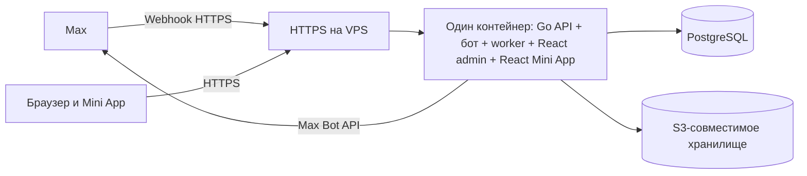

# Техническая спецификация «ШАГ»

Версия 0.1 · 25 сентября 2026 года · статус: проект спецификации

## 1. Назначение

Сервис связывает заказчиков и исполнителей через бот и Mini App в мессенджере Max. Заказчик управляет заявками в веб-кабинете; исполнитель получает предложения в Max, откликается, выполняет задачу и видит историю работ.

Визуальная система описана в [DESIGN_SYSTEM.md](DESIGN_SYSTEM.md). Этот документ фиксирует технологический стек, границы компонентов, данные, правила работы и варианты размещения.

## 2. Технологический стек

| Компонент | Технология | Назначение |
| --- | --- | --- |
| Бот Max и серверное API | Go | Webhook, команды и кнопки бота, бизнес-правила, авторизация, уведомления, CSV |
| Веб-кабинет заказчика | React + TypeScript | Заявки, отклики, роли, события, оценки, аналитика |
| Mini App исполнителя | React + TypeScript | Лента задач, отклики, активные заказы, профиль |
| База данных | PostgreSQL | Пользователи, компании, заявки, отклики, события, оценки, очередь уведомлений |
| Хранение файлов | S3-совместимое объектное хранилище | Вложения заявок; локально допускается MinIO |
| Контейнер приложения | Один Docker-образ | Go-сервер, бот, фоновая доставка уведомлений и обе собранные React-сборки |
| HTTPS на VPS | Caddy или Nginx на хосте | TLS и передача входящих запросов в контейнер приложения |
| Локальная среда и VPS | Docker Compose | Запуск приложения и отдельной инфраструктуры |

Оба React-приложения находятся в одном репозитории и используют общий пакет компонентов/токенов. При сборке Docker-образа их статические файлы копируются в финальный образ Go. **В production работает один контейнер приложения и один Go-процесс**: HTTP API и webhook обслуживаются сервером, очередь уведомлений обрабатывается фоновым worker внутри того же процесса. PostgreSQL и хранилище файлов остаются отдельными сервисами/томами, чтобы данные сохранялись при обновлении приложения.

## 3. Схема взаимодействия

Go-сервер отдаёт `/admin/` и `/app/` со SPA fallback, а также `/api/v1/*` и `/integrations/max/webhook`. Оба React-клиента обращаются к API того же домена. Сервер — единственный источник правды о статусах, рейтингах и правах доступа. Клиенты не меняют состояние локально без подтверждения API. Взаимодействие с Max вынесено в адаптер, чтобы изменения платформенного API не затрагивали бизнес-логику.

## 4. Функциональные контуры

### 4.1. Бот Max на Go

- Принимает события через webhook и отвечает на действия пользователя в чате.
- Показывает краткую карточку доступной задачи с кнопкой «Откликнуться» или открытия Mini App.
- По кнопке проверяет актуальный статус задачи, права и отсутствие дублирующего отклика.
- Отправляет адресные уведомления об отклике, назначении, смене статуса, завершении и отклонении.
- Не хранит бизнес-состояние в сообщениях Max: любое действие повторно проверяется на сервере.
- Ограничивает повторные и слишком частые отправки; не блокирует webhook во время внешних вызовов.

### 4.2. Кабинет заказчика на React

- Вход сотрудника, выбор доступной компании, роли и разрешённых действий.
- Создание и редактирование заявки: тип, описание, динамические поля, бюджет, дедлайн, геолокация, файлы.
- Список заявок, фильтры, детали, журнал событий.
- Таблица откликов: имя из Max, рейтинг, число оценок, число завершённых работ, время отклика, «Принять» / «Отклонить».
- Назначение одного исполнителя с защитой от конкурирующих решений нескольких менеджеров.
- Оценка 1–5 звёзд с обязательным непустым комментарием. Изменение оценки разрешено только до истечения 14 суток после закрытия задачи; срок проверяется сервером.
- Аналитика за выбранный период: средний рейтинг, время реакции менеджеров, число закрытых задач; экспорт CSV с теми же фильтрами и правами.

### 4.3. Mini App исполнителя на React

- Авторизация на основе данных запуска Mini App, проверяемых сервером.
- При первом запуске исполнитель вручную вводит фамилию и имя, телефон, пол и возраст. Имя из Max не подставляется: оно может быть никнеймом. Сервер и форма требуют минимум два слова из букв; достоверность имени без проверки документов не подтверждается. Сохранённый односоставный никнейм требует исправления при следующем открытии; профиль можно редактировать из Mini App. Телефон можно запросить через MAX Bridge с разрешения пользователя, а при отказе ввести вручную в формате `+7 (999) 123-45-67`. Пол выбирается из вариантов «Мужской» и «Женский», возраст вводится вручную. После сохранения профиля отдельного шага входа нет: при следующих запусках профиль находится по подтверждённому Max ID.
- Лента доступных задач и детальная карточка с бюджетом, сроком, местом и вложениями.
- Отклик на задачу и отображение его текущего состояния.
- Активный заказ с действиями «Взял в работу» и «Завершить».
- Профиль: активные/архивные задачи, средняя оценка, число отзывов, доля принятых откликов.
- Обновление данных при возвращении в приложение и после действий. Уведомления о важных изменениях доставляет бот Max; Mini App не полагается на постоянно открытое соединение.

## 5. Роли и доступ

Начальная ролевая модель внутри компании:

| Роль | Возможности |
| --- | --- |
| Владелец компании | Управление сотрудниками и ролями, все заявки, назначения, оценки, аналитика и экспорт |
| Менеджер | Создание и ведение доступных ему заявок, обработка откликов, назначение, оценка |
| Наблюдатель | Просмотр разрешённых заявок и аналитики без изменяющих действий |
| Исполнитель | Только доступные ему задачи, собственные отклики, заказы и профиль через Mini App/бота |

Права проверяются в Go API на каждом запросе. Принадлежность данных компании задаётся `company_id`; выборка без ограничения по компании запрещена. Видимость задач для исполнителя (публичные, по приглашению, внутри определённой компании) должна быть зафиксирована продуктовым правилом до реализации фильтров.

Исключение для базы исполнителей: авторизованные сотрудники кабинета видят всех зарегистрированных через Max исполнителей независимо от компании в отдельной вкладке. API списка доступен только после входа сотрудника.

В интерфейсах и сообщениях поле `deadline` показывается как «Начало работ»; техническое имя API и БД сохраняется. При публикации значение должно быть в будущем. Админка передаёт `startOffsetMinutes` для выбранной даты; бот показывает время с этим часовым сдвигом. Для ранее созданных заявок, где сдвиг не сохранялся, принят UTC+3. Номер заявки в сообщениях исполнителю не показывается.

## 6. Состояния и бизнес-правила

### Заявка

`draft` → `open` → `assigned` → `in_progress` → `awaiting_confirmation` → `completed`. В ходе работы заказчик может перевести заявку в `paused` и вернуть в `in_progress`.

Дополнительный терминальный статус — `cancelled`. Наличие откликов — вычисляемый признак открытой заявки, а не отдельное состояние базы.

| Переход | Инициатор | Условие |
| --- | --- | --- |
| Черновик → открыта | Заказчик | Заполнены обязательные поля |
| Открыта → назначена | Уполномоченный сотрудник | Выбран действующий отклик; назначен только один исполнитель |
| Назначена → в работе | Назначенный исполнитель | Нажата кнопка «Взял в работу» |
| В работе → ожидает подтверждения | Назначенный исполнитель | Нажата кнопка «Завершить» |
| Ожидает подтверждения → завершена | Уполномоченный сотрудник | Подтверждено выполнение с оценкой 1–5 и текстовым комментарием; статус, оценка и время завершения сохраняются вместе |
| В работе → приостановлена → в работе | Уполномоченный сотрудник | Пауза и возобновление заявки |
| Открыта/назначена/в работе → отменена | Уполномоченный сотрудник | По согласованным правилам отмены; причина записывается в журнал |

В первой версии подтверждение заказчиком выполняется действием «Подтвердить завершение». Спорные ситуации и возврат на доработку требуют отдельного продуктового правила.

### Отклик

Один активный отклик исполнителя на одну заявку. Состояния: `pending`, `accepted`, `rejected`, `withdrawn`. Принятие одного отклика атомарно переводит заявку в `assigned`, а остальные ожидающие отклики — в `rejected` с причиной `another_applicant_selected`. Повторный запрос не создаёт новый отклик.

### Рейтинг

При подтверждении завершения заказчик обязательно выбирает `score` от 1 до 5 и вводит текстовый комментарий после удаления пробелов. Закрытие заявки и первичная оценка сохраняются одной транзакцией. Оценку можно изменить до `completed_at + 14 суток` по UTC. После этого чтение доступно, изменение запрещено на уровне API. Время создания и всех правок записывается в журнал.

### Аналитика

- **Средний рейтинг:** среднее арифметическое оценок по завершённым заявкам за выбранный период; рядом показывать число оценок.
- **Время реакции менеджеров:** от первого отклика на заявку до первого решения по отклику; считать только заявки, где такое решение состоялось. Метрику показывать с единицей измерения и числом наблюдений.
- **Закрытые задачи:** число заявок, перешедших в `completed` за период.
- **Доля принятых откликов исполнителя:** принятые / все рассмотренные отклики; ожидающие не входят в знаменатель.

CSV выгружается в UTF-8 с заголовками столбцов, периодом и фильтрами. Если нужна совместимость с Excel, добавить BOM по согласованию. Часовой пояс отображения задаётся компанией; в БД время хранится в UTC.

## 7. Данные

Основные таблицы: `companies`, `company_members`, `users`, `max_identities`, `task_types`, `task_field_definitions`, `tasks`, `task_field_values`, `task_attachments`, `applications`, `task_events`, `ratings`, `notification_outbox`, `notification_deliveries`, `admin_sessions`.

Минимальные связи и ограничения:

- `users` содержит внутренний ID; `max_identities` связывает его с ID пользователя Max. Имя из Max хранится как отображаемый снимок и обновляется при взаимодействии.
- `tasks.company_id` и `company_members.company_id` используются для изоляции компаний.
- У `task_field_definitions` есть тип (`text`, `number`, `select`, `date`, `boolean`), обязательность и схема допустимых значений; сервер валидирует `task_field_values` по версии формы, сохранённой с заявкой.
- У заявки не более одного назначенного исполнителя; при переходе в `assigned` используется транзакция и блокировка строки либо эквивалентная защита от гонок.
- Уникальность активного отклика по паре `(task_id, user_id)` обеспечивается базой.
- `task_events` — журнал без редактирования задним числом: тип события, автор, время, прежнее/новое состояние и безопасные для хранения метаданные.
- В БД лежат метаданные вложений и ключ объекта; сами файлы — в хранилище. Ссылки на скачивание краткоживущие и выдаются после проверки доступа.
- `notification_outbox` создаётся в той же транзакции, что и изменение заявки; worker доставляет событие с повторами и фиксирует результат.

Миграции схемы — версионированные, запускаются отдельной командой перед стартом новой версии приложения. Резервное копирование охватывает и PostgreSQL, и файлы.

## 8. API и безопасность

Публичный JSON API с префиксом `/api/v1`. Ориентировочные группы маршрутов:

| Группа | Операции |
| --- | --- |
| `/auth/*` | Вход сотрудника, обновление и завершение сессии; обмен проверенными данными запуска Mini App на серверную сессию |
| `/tasks/*` | Список, создание, изменение, просмотр, переходы статуса, события, вложения |
| `/tasks/{id}/applications/*` | Отклик, список, принятие, отклонение, отзыв |
| `/tasks/{id}/rating` | Создание, чтение, разрешённое редактирование оценки |
| `/me/*` | Профиль исполнителя, активные и архивные заказы, статистика |
| `/analytics/*` | Метрики и CSV с одинаковыми фильтрами |
| `/company/*` | Сотрудники и роли |
| `/integrations/max/webhook` | Приём событий Max |
| `/health/live`, `/health/ready` | Проверки процесса и зависимостей |

Обязательные меры:

- `window.WebApp.initData` передаётся на Go API и проверяется там по официальному алгоритму Max, включая подпись и срок действия. `initDataUnsafe` не является основанием для авторизации.
- Webhook проверяет `X-Max-Bot-Api-Secret`; секрет и токен бота хранятся только на сервере. Обработчик возвращает успешный ответ после надёжной фиксации события/задачи на обработку, не ожидая отправки сообщений.
- Админские сессии — защищённые `HttpOnly`, `Secure`, `SameSite` cookie; CSRF-защита для изменяющих запросов. Первичный вход сотрудников — email и пароль. Порядок выдачи первого пароля и восстановления доступа ещё нужно определить.
- Проверка прав и принадлежности компании выполняется на сервере; фронтенд лишь отражает доступные действия.
- Ограничение размера и типов файлов, безопасные имена объектов, антивирусная проверка при наличии требования заказчика; вложения не публикуются открытым URL.
- Ограничение частоты для входа, откликов и webhook; идемпотентность событий и команд, чтобы повторы доставки не дублировали назначения или уведомления.
- Секреты не записываются в Git, логи и образы. Логи содержат request ID и технический результат, но не токены и содержимое приватных файлов.

## 9. Интеграция с Max

При публикации создаются бот и связанное с ним Mini App; в настройках бота указывается постоянный HTTPS URL Mini App. Бот получает события через подписку на webhook, а исходящие сообщения отправляет через Bot API. Кнопки сообщений могут быть callback или открывать приложение; точные payload и типы событий фиксируются при реализации по актуальной документации Max.

По состоянию документации на дату спецификации:

- Mini App должен открываться по `https://`.
- Webhook должен быть публичным HTTPS endpoint на порту 443 с доверенным сертификатом; должен отвечать `200` в течение 30 секунд.
- Для проверки webhook предусмотрен заголовок `X-Max-Bot-Api-Secret`.
- Для вызовов Bot API используется домен `platform-api2.max.ru`.
- Сервер проверяет подпись данных запуска Mini App; клиентские данные без проверки не считаются доверенными.

Перед релизом повторно проверить актуальные требования Max, регистрацию бота, возможность подключения Mini App, сертификаты и лимиты отправки.

## 10. Размещение и окружения

### 10.1. Сборка одного образа приложения

Один многоэтапный `Dockerfile` сначала собирает кабинет React и Mini App React, затем Go-бинарник. В финальный образ помещаются Go-бинарник и обе папки `dist`; Node.js и исходники фронтенда в runtime-слое не нужны. Go-сервер отдаёт статику и обрабатывает API, webhook и фоновую очередь уведомлений **в одном процессе**. Для фоновой работы используются отдельные goroutine с корректной остановкой и ожиданием завершения при `SIGTERM`.

Маршруты единого приложения: `/admin/` — кабинет, `/app/` — Mini App, `/api/v1/*` — JSON API, `/integrations/max/webhook` — webhook, `/health/*` — проверки здоровья. URL Mini App, заданный в Max, ведёт на `https://<домен>/app/`. Для маршрутов внутри React-приложений Go отдаёт соответствующий `index.html`; API-маршруты не попадают в SPA fallback. Обе React-сборки обращаются к относительному `/api/v1`, поэтому работают с одним доменом и не требуют междоменных запросов.

### 10.2. Локальная разработка — Docker Compose

Команда `docker compose up --build` запускает три контейнера: `app` (Go + обе React-сборки), `postgres` и `minio` для вложений. База и объекты сохраняются в именованных томах. В dev-профиле допускается отдельный режим горячей перезагрузки кода, но проверяемая локальная сборка должна работать в той же **трёхконтейнерной** схеме, что и VPS.

Локальный запуск не зависит от доступности Max: webhook и отправка сообщений подменяются тестовым адаптером. Для просмотра Mini App на `localhost` при `APP_ENV=local` используется отдельная локальная идентичность с сохранением профиля в локальную PostgreSQL; на других адресах и в production данные запуска Max обязательны. Для ручной проверки реального Max используется временный публичный HTTPS-туннель и тестовый бот. В репозитории должны быть `compose.yaml`, один `Dockerfile` приложения, `.env.example`, инструкции запуска и миграций. Реальные секреты хранятся только в локальном `.env`.

### 10.3. VPS — Docker Compose

На VPS запускаются те же три контейнера: `app`, `postgres`, `minio`. PostgreSQL — **отдельный контейнер Docker Compose** с постоянным томом; порт БД наружу не публикуется. MinIO также доступен только приложению по внутренней сети Compose, его данные хранятся в отдельном томе. При выборе внешнего S3 в будущем приложение не пересобирается, меняются только переменные окружения.

HTTPS завершается общим Traefik на VPS; контейнер `app` подключён к его внешней сети `proxy` без опубликованного порта. Для проекта по-прежнему работает один контейнер приложения и один Go-процесс; Traefik обслуживает также другие сайты сервера. Публичный HTTPS на 443 и перенаправление HTTP на HTTPS используют один домен для webhook Max и Mini App. Сертификат выпускается через Let's Encrypt. Релиз включает резервную копию, миграции, запуск нового образа, проверку `/health/ready` и план отката с учётом совместимости схемы БД.

### 10.4. Границы размещения

Production-цель этой спецификации — **VPS**. Обычный веб-хостинг больше не входит в целевую схему: он не обеспечивает постоянную работу Go-бота и не запускает единый Docker-контейнер приложения. Переход на другой VPS требует переноса томов/резервных копий и настроек домена, но не изменений бизнес-кода.

| Сервис | Локально | На VPS |
| --- | --- | --- |
| `app` | Один контейнер: Go + React admin + React Mini App | Тот же образ и один контейнер |
| `postgres` | Отдельный контейнер и том | Отдельный контейнер и том |
| `minio` | Отдельный контейнер и том | Отдельный контейнер и том |
| HTTPS | Не обязателен; туннель для реального Max | Общий Traefik VPS, порт 443 |
| Секреты | `.env`, не в Git | Файл окружения с ограниченным доступом |

Минимальные переменные окружения: `DATABASE_URL`, `S3_ENDPOINT`, `S3_BUCKET`, `S3_ACCESS_KEY`, `S3_SECRET_KEY`, `MAX_BOT_TOKEN`, `MAX_WEBHOOK_SECRET`, `PUBLIC_BASE_URL`, `SESSION_SECRET`, `APP_ENV`. Для каждой среды значения разные; тестовый бот Max не использует production-базу.

Резервные копии PostgreSQL выполняются по расписанию и проверяются восстановлением. Для вложений выполняется отдельная копия данных MinIO. Сборка React получает только публичные параметры, ни один секрет не попадает в JavaScript-бандл.

## 11. Наблюдаемость и качество

- Структурированные логи Go API и worker; ключевые поля: request ID, событие, ID заявки, результат, длительность.
- Метрики: доступность API, задержка webhook, глубина очереди уведомлений, ошибки Max API, ошибки БД, время формирования CSV.
- Проверки: unit-тесты бизнес-переходов и 14-дневного окна, интеграционные тесты БД для конкурентного назначения, контрактные проверки адаптера Max на фикстурах, сквозные сценарии двух React-приложений.
- CI: форматирование и lint Go/TypeScript, тесты, сборка единого образа приложения, проверка миграций и отсутствие секретов в репозитории.

## 12. Критерии готовности первой версии

1. Заказчик создаёт заявку с динамическими полями, бюджетом, сроком, геолокацией и вложением; исполнитель видит её в Mini App и может откликнуться.
2. Заказчик принимает один отклик, остальные получают согласованный результат; конкурентное принятие не назначает двух исполнителей.
3. Исполнитель последовательно переводит назначенный заказ в работу и завершает его; изменения видны в кабинете и доставляются через бота Max.
4. Журнал отображает основные действия с автором и временем; оценка требует комментарий и блокируется через 14 суток после завершения.
5. Аналитика и CSV показывают согласованные показатели при одинаковых фильтрах и соблюдают роли.
6. Локальная среда запускается одной командой Docker Compose; на VPS разворачивается тот же единый образ приложения с Go, ботом, админкой и Mini App. PostgreSQL и MinIO работают в отдельных контейнерах с постоянными томами.
7. Webhook доступен по HTTPS, проверяет секрет, а данные запуска Mini App проверяются на сервере.

## 13. Решения, которые нужно согласовать до реализации

1. Какая конкретно VPS используется: ресурсы сервера, домен, политика резервного копирования и регион хранения данных.
2. Вход выбран по email и паролю. Первый владелец компании создаётся разовой серверной командой с паролем, который передаётся через переменную окружения. Восстановление доступа и необходимость двухфакторной проверки ещё нужно определить.
3. Опубликованные заявки видят все зарегистрированные исполнители Mini App. Географические ограничения пока не заданы.
4. Что означает «Завершить»: достаточно действия исполнителя или заказчик подтверждает результат.
5. Есть ли оплата внутри системы, комиссии и финансовые документы. Текущая спецификация учитывает **бюджет как информационное поле**, без платёжного контура.
6. Для первой версии согласованы вложения до 5 МБ на файл: изображения, PDF, TXT и ZIP. Сроки хранения заявок, файлов и персональных данных ещё нужно определить.

## 14. Официальные источники Max

- [Создание и размещение Mini App](https://dev.max.ru/docs/webapps/introduction)
- [MAX Bridge и данные запуска](https://dev.max.ru/docs/webapps/bridge)
- [Проверка данных запуска](https://dev.max.ru/docs/webapps/validation)
- [Подписка на webhook](https://dev.max.ru/docs-api/methods/POST/subscriptions)
- [Кнопки в сообщениях](https://dev.max.ru/docs-api/use-cases/sending-messages/keyboard)
- [Отправка сообщений](https://dev.max.ru/docs-api/methods/POST/messages)
